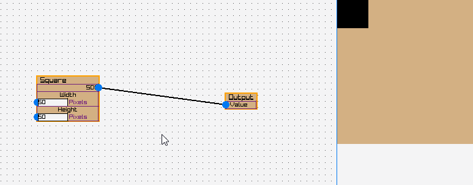

## About
node editor -> tree of SDF operations -> imgage.

## Architecture
### FiddlyNodes is the main C# project.
It contains the rendering engine and the UI framework. It's built on RayLib.

**Thistle** is the rendering stack. Named from the project I took it from, a programming language that compiled to SDF images. Its graph-structure is built around **TreeBaseObject**, and what we are "making" with the node system is just a network of these objects.
The graph is created by the Output node kicking off a walk backwards along the UI nodes, creating a hierarchical tree structure. Since I ripped this entire structure from another project, it's a little out of place... but it's working well.

**InputManager** connects raylib's key/mouse input to a hierarchical bubble-up input system. An inputEvent is passed to each valid Element in order from most to least relevant, stopping whenever it is 'handled'.
**PortConnector** is basically just an extension of the input system. Input is mostly handled in ugly if/else branches inside of Element classes. It's messy but good-enough, since the raylib/os side of getting input form the OS and the command system side of *doing* things are separated.

**Element** is the core UI. It's codependent with a RectTransform class (*the only part of this that I had AI help me with, and it was a horrible experience. Can't recommend it, and now the code is hard for me to refactor, buggy, and out of place in the codebase...*). Elements have a Draw function that recursively call their children, and call RayLib draw functions. So it's an immediate-mode GUI.

**GridCanvas** is the element that has all the nodes as it's children. (Actually, it keeps a child object it pans/zooms around with). It has the **WireManager**.
The wireManager is a hacky insert that basically pretends to be an element for all of the wires. Giving every wire it's own element didn't seem to make sense, although I may change my mind on that.

**CommandSystem** is the undo/redo history. Everything you do goes through the Command abstract class and gets executed there, where it's put on a stack that can be undone. Complex commands can have implement their own subcommands, such that - as far as the CommandSystem is concerned - each item is a single point in history to undo/redo to.
I aim to use the prefix "Do" for actions that the command system calls (the "actual" functions that have effects), and functions that aren't prefixed with "do" would be the ones creating a command.

